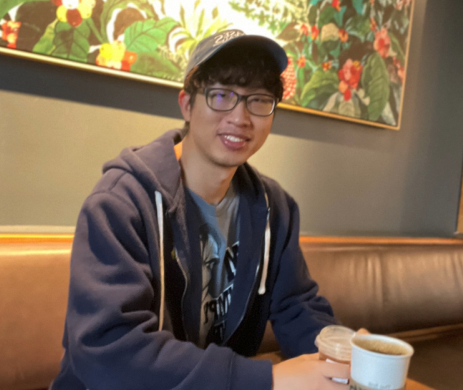

### **About Me**

I am currently an assistant professor in the [Department of Mathematical Sciences](https://mathsci.kaist.ac.kr/home/en/) at the [Korea Advanced Institute of Science and Technology (KAIST)](https://www.kaist.ac.kr/en/). Previously, I was a ML scientist at AWS AI Labs. Before that, I was a Neyman Visiting Assistant Professor in the [Department of Statistics](https://statistics.berkeley.edu/) at [UC Berkeley](https://www.berkeley.edu/), where I was very fortunate to be supervised by [Bin Yu](https://www.stat.berkeley.edu/~binyu/Site/Welcome.html). Prior to that, I was a Postdoctoral fellow at UC Berkeley's [Foundations of Data Analysis (FODA) Institute](https://foda.berkeley.edu/) and [Berkeley Institute for Data Science (BIDS)](https://bids.berkeley.edu/). I obtained my PhD in Statistics at the [University of Chicago](http://galton.uchicago.edu/) where I was very fortunate to be advised by [Rina Foygel Barber](http://galton.uchicago.edu/~rina/). My PhD research was supported by [Kwanjeong Fellowship](http://en.ikef.or.kr/).

My research is centered on high-dimensional statistics and machine learning, with a focus on sparse and low rank optimization, local graph clustering, and interpretable machine learning, and domain adaptation under distribution shifts. I am also interested in the applications of statistical and optimization methods to diverse scientific areas such as medical imaging, population genetics, and cosmology. 

### **Education**

[The University of Chicago](https://www.uchicago.edu/)
* Ph.D. in Statistics, 2018
* Advisor: [Rina Foygel Barber](http://galton.uchicago.edu/~rina/)

[Seoul National University](http://en.snu.ac.kr/)
* M.S., Statistics, 2013 (Advisor: [Byeong U. Park](https://stat.snu.ac.kr/theostat/BUPark.htm))
* B.S., Statistics, B.A., Economics, Minor in Mathematics, 2011

Wooseok Ha  
[haywse@kaist.ac.kr](mailto: haywse@kaist.ac.kr)
