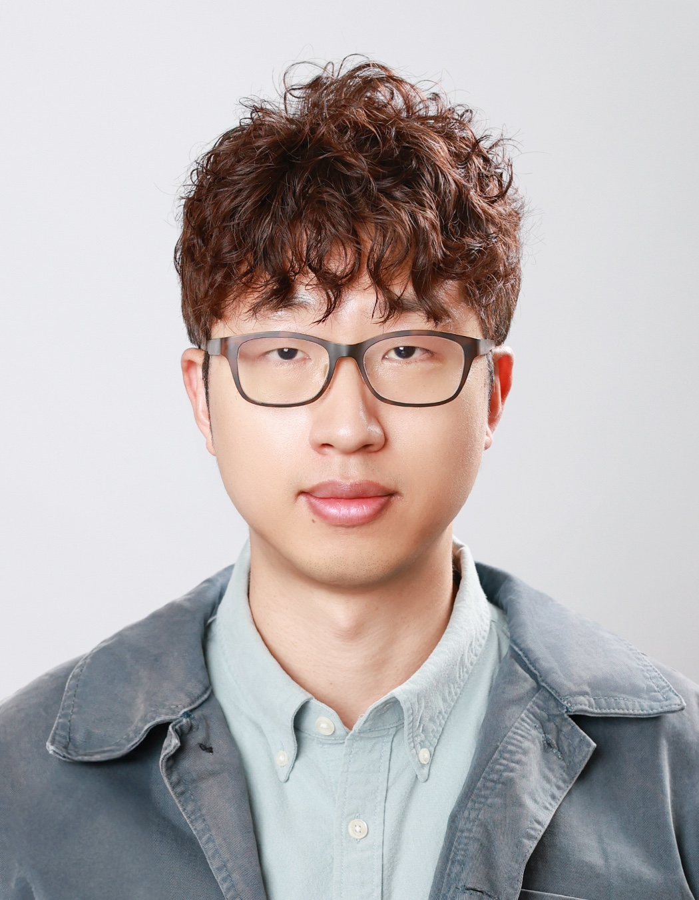

### **About Me**

I am currently an assistant professor in the [Department of Mathematical Sciences](https://mathsci.kaist.ac.kr/home/en/) at the [Korea Advanced Institute of Science and Technology (KAIST)](https://www.kaist.ac.kr/en/). Previously, I was a ML scientist at AWS AI Labs. Before that, I was a Neyman Visiting Assistant Professor in the [Department of Statistics](https://statistics.berkeley.edu/) at [UC Berkeley](https://www.berkeley.edu/), where I was very fortunate to be supervised by [Bin Yu](https://www.stat.berkeley.edu/~binyu/Site/Welcome.html). Prior to that, I was a Postdoctoral fellow at UC Berkeley's [Foundations of Data Analysis (FODA) Institute](https://foda.berkeley.edu/) and [Berkeley Institute for Data Science (BIDS)](https://bids.berkeley.edu/). I obtained my PhD in Statistics at the [University of Chicago](http://galton.uchicago.edu/) where I was very fortunate to be advised by [Rina Foygel Barber](http://galton.uchicago.edu/~rina/). My PhD research was supported by [Kwanjeong Fellowship](http://en.ikef.or.kr/).

My research is centered on high-dimensional statistics and machine learning, with a focus on sparse and low rank optimization, local graph clustering, and interpretable machine learning, and domain adaptation under distribution shifts. I am also interested in the applications of statistical and optimization methods to diverse scientific areas such as medical imaging, population genetics, and cosmology. 

### **Education**

[The University of Chicago](https://www.uchicago.edu/)
* Ph.D. in Statistics, 2018
* Advisor: [Rina Foygel Barber](http://galton.uchicago.edu/~rina/)

[Seoul National University](http://en.snu.ac.kr/)
* M.S., Statistics, 2013 (Advisor: [Byeong U. Park](https://stat.snu.ac.kr/theostat/BUPark.htm))
* B.S., Statistics, B.A., Economics, Minor in Mathematics, 2011

### **Preprints / Publications**
- Variance-reduced zeroth-order methods for fine-tuning language models. Tanmay Gautam, Youngsuk Park, Hao Zhou, Parameswaran Raman, and Wooseok Ha. Accepted at the 41st International Conference on Machine Learning (_ICML 2024_). [arXiv:2404.08080](https://arxiv.org/abs/2404.08080). 

- Prominent roles of conditionally invariant components in domain adaptation: theory and algorithms. Keru Wu\*, Yuansi Chen\*, Wooseok Ha\*, Bin Yu. [arXiv:2309.10301](https://arxiv.org/pdf/2309.10301.pdf). Submitted.

- The effect of SGD batch size on autoencoder learning: sparsity, sharpness, and feature learning. Nikhil Ghosh, Spencer Frei, Wooseok Ha, Bin Yu. [arXiv:2308.03215](https://arxiv.org/pdf/2308.03215.pdf). Submitted.

- Gradient dynamics of single-neuron autoencoders on orthogonal data. Nikhil Ghosh, Spencer Frei, Wooseok Ha, Bin Yu. OPT 2022: Optimization for Machine Learning (_NeurIPS 2022 Workshop_).

- Interpreting and improving deep-learning models with reality checks. Chandan Singh\*, Wooseok Ha\*, Bin Yu. International Workshop on Extending Explainable AI Beyond Deep Models and Classifiers. [arXiv:2108.06847](https://arxiv.org/pdf/2108.06847.pdf)

- [Adaptive wavelet distillation from neural networks through interpretations.](https://proceedings.neurips.cc/paper/2021/file/acaa23f71f963e96c8847585e71352d6-Paper.pdf) ([Package.](https://github.com/Yu-Group/adaptive-wavelets)) Wooseok Ha, Chandan Singh, Francois Lanusse, Srigokul Upadhyayula, Bin Yu. 34th Annual Conference on Neural Information Processing Systems (_Neurips 2021_). [arXiv:2107.09145](https://arxiv.org/pdf/2107.09145.pdf)

- [Fast and flexible estimation of effective migration surfaces.](https://elifesciences.org/articles/61927) ([Package.](https://github.com/NovembreLab/feems), [Reproducible Code.](https://github.com/jhmarcus/feems-analysis)) Joseph H. Marcus\*, Wooseok Ha\*, Rina Foygel Barber, John Novembre. _eLife_. [bioRXiv:2020.08.07.242214](https://www.biorxiv.org/content/10.1101/2020.08.07.242214v1)

- Transformation importance with applications to cosmology. Chandan Singh\*, Wooseok Ha\*, Francois Lanusse, Vanessa Boehm, Jia Liu, Bin Yu. _ICLR 2020 Workshop on Fundamental Science in the era of AI (Spotlight talk)_. [arXiv:2003.01926](https://arxiv.org/pdf/2003.01926.pdf)

- [Statistical guarantees for local graph clustering.](https://www.jmlr.org/papers/volume22/20-029/20-029.pdf) Wooseok Ha\*, Kimon Fountoulakis\*, Michael, W. Mahoney. 23rd International Conference on Artificial Intelligence and Statistics (_AISTATS 2020_). Journal version _Journal of Machine Learning Research_. [arXiv:1906.04863](https://arxiv.org/pdf/1906.04863.pdf)

- [An equivalence between critical points for rank constraints versus low-rank factorizations.](https://epubs.siam.org/doi/abs/10.1137/18M1231675) Wooseok Ha, Haoyang Liu, and Rina Foygel Barber. _SIAM Journal on Optimization_. [arXiv:1812.00404](https://arxiv.org/abs/1812.00404)

- [Alternating minimization based framework for simultaneous spectral calibration and image reconstruction in spectral CT.](https://ieeexplore.ieee.org/abstract/document/8824673/) Wooseok Ha, Emil Y Sidky, Rina Foygel Barber, Taly Gilat Schmidt, and Xiaochuan pan. 2018 IEEE Nuclear Science Symposium and Medical Imaging Conference.

- [Estimating the spectrum in computed tomography via Kullback-Leibler divergence constrained optimization.](https://aapm.onlinelibrary.wiley.com/doi/full/10.1002/mp.13257?elq_cid=11976044&elq_mid=33203)
Wooseok Ha, Emil Y Sidky, Rina Foygel Barber, Taly Gilat Schmidt, and Xiaochuan pan. _Medical Physics_. [arXiv:1805.00162](https://arxiv.org/abs/1805.00162). **Selected as Editor's Pick designation**

- Alternating minimization and alternating descent over nonconvex sets. ([Code.](http://galton.uchicago.edu/~rina/code/altmin_simulation.R))
Wooseok Ha and Rina Foygel Barber. [arXiv:1709.04451](https://arxiv.org/abs/1709.04451)

- [Gradient descent with nonconvex constraints: local concavity determines convergence.](https://academic.oup.com/imaiai/advance-article/doi/10.1093/imaiai/iay002/4904162) ([Code.](http://galton.uchicago.edu/~rina/concavity.html))
Rina Foygel Barber and Wooseok Ha. _Information and Inference_. [arXiv:1703.07755](https://arxiv.org/abs/1703.07755)

- [X-ray spectral calibration from transmission measurements using Gaussian blur model.](https://www.spiedigitallibrary.org/conference-proceedings-of-spie/10132/1/X-ray-spectral-calibration-from-transmission-measurements-using-Gaussian-blur/10.1117/12.2254406.short?SSO=1)
Wooseok Ha, Emil Y Sidky and Rina Foygel Barber. _Proceedings of the SPIE conference on Medical Imaging 2017: Physics of Medical Imaging_.

- Trimmed conformal prediction for high-dimensional models.
Wenyu Chen, Zhaokai Wang, Wooseok Ha, Rina Foygel Barber. [arXiv:1611.09933](https://arxiv.org/abs/1611.09933)

- [Robust PCA with compressed data.](http://papers.nips.cc/paper/5705-robust-pca-with-compressed-data)
Wooseok Ha and Rina Foygel Barber. 28th Annual Conference on Neural Information Processing Systems (_NIPS 2015_).

### **Extended Abstracts**

- Simultaneous spectral scaling and basis material map reconstruction for spectral CT with photon-counting detectors.
Emil Y Sidky, Taly Gilat Schmidt, Rina Foygel Barber, Wooseok Ha, and Xiaochuan Pan. 4th International Conference on Image Formation in X-ray Computed Tomography (_CT meeting 2016_).

### **Teaching**

- MAS555/DS512: Advanced Statistics (Spring 2024) at KAIST.

- STAT88: Probability and Mathematical Statistics in Data Science (Fall 2020) at UC Berkeley.

- STAT158: Design and Analysis of Experiments (Spring 2020) at UC Berkeley.
